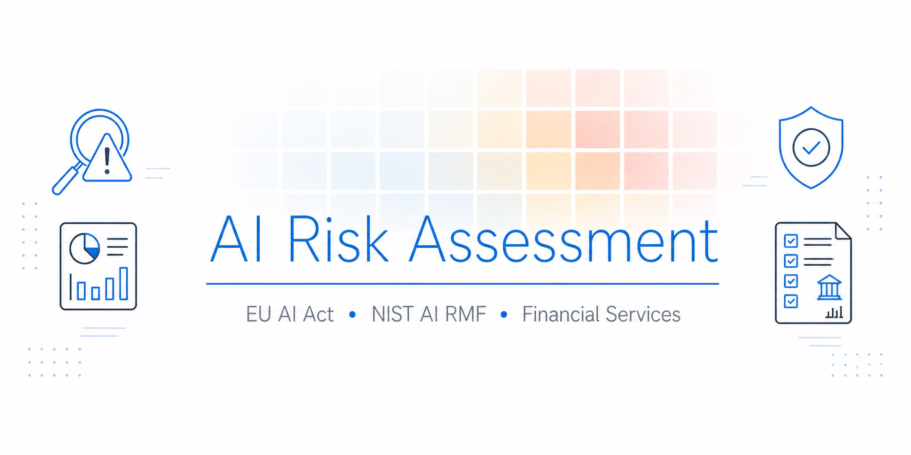
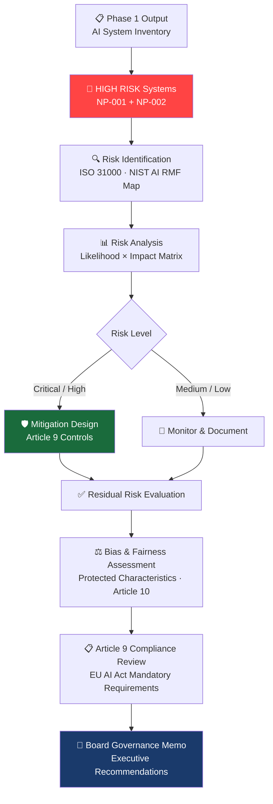
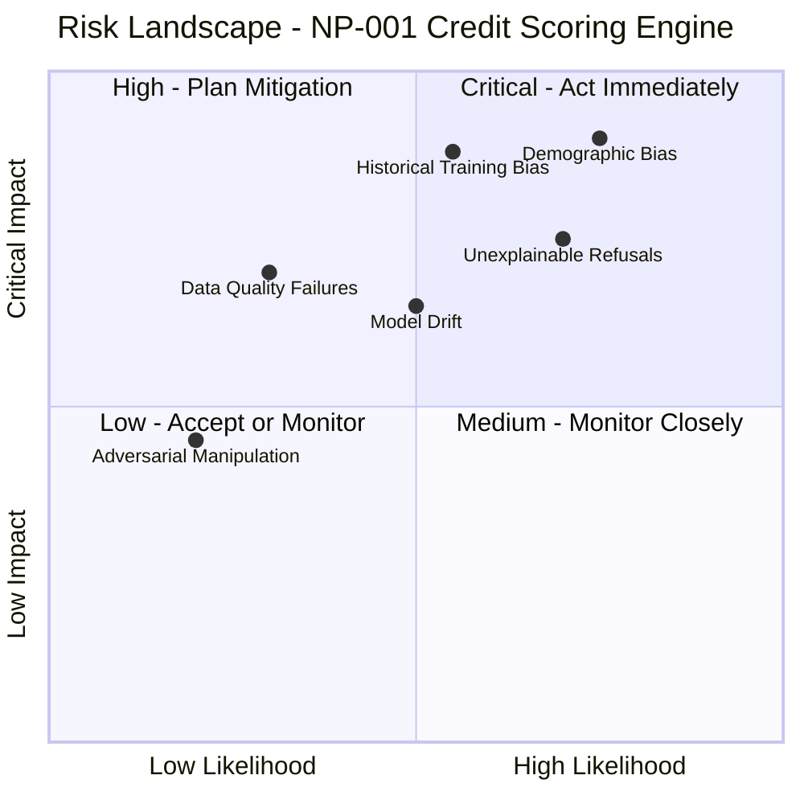

<div align="center">

<!-- BANNER: Generate using Google Flow with this prompt and save as banner.png in repo root
GOOGLE FLOW PROMPT:
"A clean, professional banner for a GitHub repository. Wide format (1280x640px).
Title text: 'AI Risk Assessment'. Subtitle: 'EU AI Act · NIST AI RMF · Financial Services'.
Medium navy blue background (#1a2744). Subtle risk matrix or heat map pattern in background.
Icons representing risk analysis, compliance shields and financial data on both sides.
Modern, corporate, minimal. No people. Color accents: bright electric blue and white.
High contrast - text must be clearly readable."
-->


# ⚠️ AI Risk Assessment - NorthPoint Financial Services

[](https://artificialintelligenceact.eu/)
[](https://airmf.nist.gov/)
[](https://www.iso.org/standard/81230.html)
[](https://www.iso.org/standard/65694.html)
[](LICENSE)
[]()

**Phase 2 of an end-to-end AI Governance Programme**  

</div>

---

## 📌 Project Overview

**NorthPoint Financial Services** completed a full AI system inventory in Phase 1, identifying four production AI systems and classifying two - the **Credit Scoring Engine (NP-001)** and the **Fraud Detection System (NP-002)** - as HIGH RISK under EU AI Act Annex III.

Classification alone is not enough. The EU AI Act mandates that HIGH RISK systems undergo a documented risk management process (Article 9) before deployment and throughout their lifecycle. Phase 2 delivers that process.

This project applies structured risk assessment methodology to both HIGH RISK systems - identifying specific risk scenarios, evaluating likelihood and impact, assessing bias and fairness, reviewing Article 9 compliance and producing a board-level governance memo with executive recommendations.

> **The business context:** NorthPoint's Credit Scoring Engine makes automated decisions on loan eligibility. Its Fraud Detection System places automatic holds on customer accounts. Both systems operate with material consequences for real people - which is precisely why the EU AI Act requires documented, auditable risk governance for systems like these.

---

## 🎯 What I Delivered

| Deliverable | Description |
|---|---|
| **Risk Assessment - NP-001** | Full risk register for the Credit Scoring Engine: likelihood/impact analysis, mitigations, residual risk |
| **Risk Assessment - NP-002** | Full risk register for the Fraud Detection System: likelihood/impact analysis, mitigations, residual risk |
| **Bias & Fairness Assessment** | Analysis of demographic bias risk in NP-001 credit scoring decisions across protected characteristics |
| **EU AI Act Article 9 Review** | Compliance checklist against Article 9 mandatory requirements for both HIGH RISK systems |
| **Board Governance Memo** | Executive summary translating technical risk findings into business decisions for NorthPoint leadership |

---

## 🗺 Risk Assessment Process



---

## 🔴 Systems Assessed

Both systems are classified HIGH RISK under EU AI Act Annex III §5(b) - AI systems used in financial services that determine or materially influence access to credit, insurance or financial resources.

| ID | System | Risk Classification | Automated Decisions | Assessment Focus |
|---|---|---|---|---|
| NP-001 | Credit Scoring Engine | 🔴 HIGH RISK - Annex III §5(b) | ✅ Yes - loan eligibility | Algorithmic bias, creditworthiness fairness, explainability |
| NP-002 | Fraud Detection System | 🔴 HIGH RISK - Annex III §5(b) | ✅ Yes - account holds | False positive rate, operational disruption, customer harm |

---

## 📊 Risk Assessment Summary

### NP-001 - Credit Scoring Engine

| Risk Scenario | Likelihood | Impact | Risk Level | Status |
|---|---|---|---|---|
| Demographic bias in credit decisions | High | Critical | 🔴 Critical | Mitigation required |
| Unexplainable credit refusal (no recourse) | High | High | 🔴 High | Mitigation required |
| Training data reflecting historical discrimination | Medium | Critical | 🔴 High | Mitigation required |
| Model drift reducing accuracy over time | Medium | High | 🟡 Medium | Monitoring in place |
| Data quality failures in input pipeline | Low | High | 🟡 Medium | Controls in place |
| Adversarial manipulation of inputs | Low | Medium | 🟢 Low | Accepted |

### NP-002 - Fraud Detection System

| Risk Scenario | Likelihood | Impact | Risk Level | Status |
|---|---|---|---|---|
| High false positive rate - legitimate transactions blocked | High | High | 🔴 High | Mitigation required |
| Disproportionate impact on specific customer segments | Medium | High | 🔴 High | Mitigation required |
| System unavailability during high-volume periods | Medium | Critical | 🔴 High | Mitigation required |
| Model drift as fraud patterns evolve | High | Medium | 🟡 Medium | Monitoring in place |
| Lack of human override mechanism | Low | Critical | 🟡 Medium | Controls in place |
| Insufficient logging for dispute resolution | Low | High | 🟡 Medium | Controls in place |



→ Full risk registers with mitigation detail: [`docs/risk-assessment.md`](docs/risk-assessment.md)

---

## ⚖️ Bias & Fairness Assessment

The Credit Scoring Engine (NP-001) presents the highest bias risk of any system in NorthPoint's portfolio. As an automated decision-maker determining loan eligibility, it is subject to EU AI Act Article 10 requirements on training data governance and bias monitoring - and to broader fairness obligations under UK Equality Act and EU non-discrimination law.

**Protected characteristics assessed:**

| Characteristic | Bias Risk | Evidence Basis | Mitigation |
|---|---|---|---|
| Race / Ethnicity | 🔴 High | Postcode/geographic proxies in training data | Proxy variable audit; disparate impact testing |
| Gender | 🟡 Medium | Historical credit data reflects prior gender gaps | Fairness-aware model training; outcome monitoring |
| Age | 🟡 Medium | Younger applicants underrepresented in positive outcomes | Age-stratified performance benchmarks |
| Disability | 🟡 Medium | Income pattern differences may penalise disability benefits | Manual review pathway for flagged edge cases |

→ Full bias and fairness methodology: [`docs/bias-fairness-assessment.md`](docs/bias-fairness-assessment.md)

---

## 📋 EU AI Act Article 9 Compliance

Article 9 requires HIGH RISK AI systems to implement and maintain a **risk management system** throughout the entire lifecycle - not as a one-time exercise.

**Summary compliance status for both systems:**

| Article 9 Requirement | NP-001 Credit Scoring | NP-002 Fraud Detection |
|---|---|---|
| Risk management system established and documented | ✅ Complete | ✅ Complete |
| Risks identified across reasonably foreseeable misuse scenarios | ✅ Complete | ✅ Complete |
| Risk estimation and evaluation performed | ✅ Complete | ✅ Complete |
| Residual risks evaluated after mitigation | ✅ Complete | ✅ Complete |
| Risk management reviewed and updated regularly | ⚠️ Schedule defined - not yet formalised | ✅ Complete |
| Testing performed to identify most appropriate risk measures | ⚠️ Bias testing pending completion | ✅ Complete |

→ Full Article 9 compliance checklist: [`docs/eu-ai-act-article9-review.md`](docs/eu-ai-act-article9-review.md)

---

## 📄 Board Governance Memo

The risk assessment findings were translated into a board-level governance memo for NorthPoint's Chief Risk Officer and Board Risk Committee - communicating technical findings in business and regulatory language, with clear recommendations and ownership.

**Key recommendations from the memo:**
1. Suspend automated credit decisions for high-risk demographic segments pending bias audit completion
2. Establish a formal human review pathway for all NP-001 refusals above a defined impact threshold
3. Commission independent third-party conformity assessment for NP-001 before next regulatory cycle
4. Implement structured false-positive monitoring dashboard for NP-002 with monthly board reporting

→ Full governance memo: [`docs/governance-memo.md`](docs/governance-memo.md)

---

## 🔗 Programme Context

This project is **Phase 2** of NorthPoint Financial Services' AI Governance Programme:

| Phase | Project | Status |
|---|---|---|
| Phase 1 | [AI System Inventory & Classification Engine](https://github.com/franciscovfonseca/AI-System-Inventory) | ✅ Complete |
| Phase 2 | AI Risk Assessment *(this project)* | ✅ Complete |
| Phase 3 | AI Controls & Remediation Framework | 🔄 Coming Soon |

---

## 📁 Repository Structure

```
AI-Risk-Assessment/
├── README.md                            ← You are here
├── banner.png                           ← Project banner
├── docs/
│   ├── risk-assessment.md               ← Full risk registers - NP-001 & NP-002
│   ├── bias-fairness-assessment.md      ← Bias & fairness analysis - NP-001
│   ├── eu-ai-act-article9-review.md     ← Article 9 compliance checklist
│   └── governance-memo.md              ← Board-level executive memo
└── LICENSE
```

---

## 🧠 Skills Demonstrated

| Skill Area | What This Project Shows |
|---|---|
| **AI Risk Assessment** | Structured risk identification, analysis and evaluation across multiple HIGH RISK AI systems |
| **EU AI Act Compliance** | Article 9 risk management lifecycle; Article 10 data governance and bias obligations |
| **NIST AI RMF** | Map and Measure function application - risk identification and ongoing monitoring design |
| **ISO 31000** | Risk assessment methodology - likelihood/impact analysis, risk treatment, residual risk |
| **AI Bias & Fairness** | Protected characteristic analysis; proxy variable identification; fairness-aware mitigation design |
| **AI GRC** | End-to-end governance, risk and compliance programme management across regulated AI systems |
| **Executive Communication** | Board-level memo translating technical risk findings into business decisions and regulatory obligations |
| **Responsible AI** | Human oversight design; explainability requirements; fairness and non-discrimination principles |

---

## 📚 Frameworks & References

| Framework | Resource |
|---|---|
| EU AI Act - Article 9 (Risk Management) | [EUR-Lex 2024/1689 Art. 9](https://eur-lex.europa.eu/legal-content/EN/TXT/?uri=CELEX:32024R1689) |
| EU AI Act - Article 10 (Data Governance) | [EUR-Lex 2024/1689 Art. 10](https://eur-lex.europa.eu/legal-content/EN/TXT/?uri=CELEX:32024R1689) |
| NIST AI Risk Management Framework 1.0 | [airmf.nist.gov](https://airmf.nist.gov/) |
| ISO 31000:2018 - Risk Management Guidelines | [iso.org/standard/65694](https://www.iso.org/standard/65694.html) |
| ISO/IEC 42001:2023 - AI Management Systems | [iso.org/standard/81230](https://www.iso.org/standard/81230.html) |

---

<div align="center">

**franciscovfonseca** · [GitHub](https://github.com/franciscovfonseca) · [LinkedIn](https://linkedin.com/in/franciscovfonseca)

[](LICENSE)

*Part of an ongoing AI Governance Portfolio · [View all projects →](https://github.com/franciscovfonseca)*

</div>
